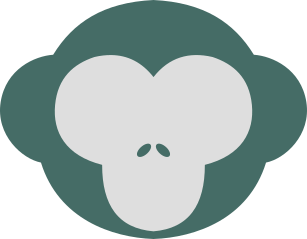

<h1 align="center">
	<br />
    	
  	<br />
  		<p>Gibbon Language</p>
  	<br />
</h1>

<h4 align="center">Yet another programming language for all ape species</h4>

## Development


### Pre-requisites
To be able to start development on Amplication, make sure that you have the following.
- Git
- Docker

### Running
```sh
docker build -t gibbon-container -f docker/gibbon-container .
```

```sh
docker run --rm -it -v ./src:/gibbon gibbon-container /bin/bash
```